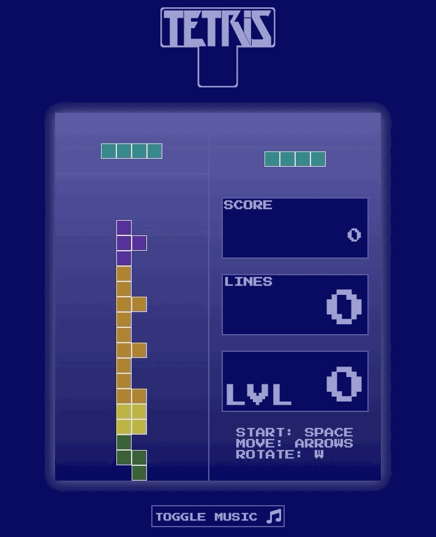
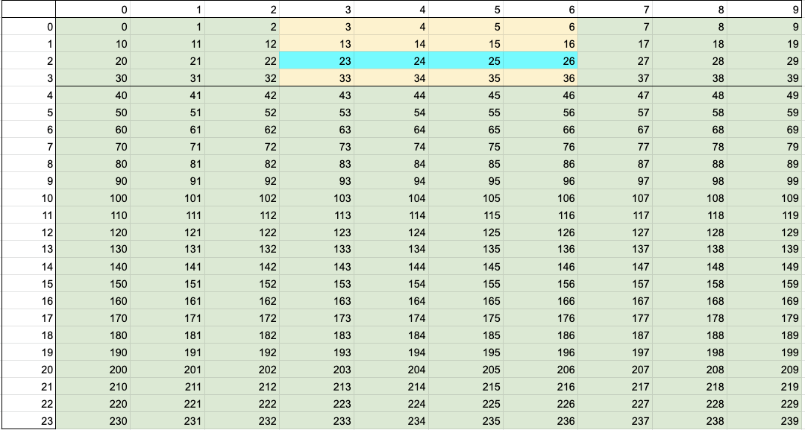
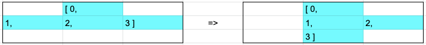
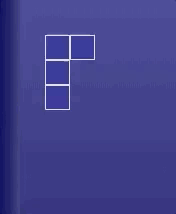

## Software Engineering Immersive at GA - Project 1: Tetris Clone

### Goal: To create a grid based game using vanilla JavaScript

### Brief: [SEI GA Project 4 brief](tetris_brief.md)

### Timeframe: 8 days
---

### Technologies used
* JavaScript (ES6)
* HTML5
* CSS3

### Deployment
The app is deployed on github page and can be found here: [https://paulcooke.github.io/tetris-vanilla-javascript/]()

### Overview

The first project on the course is a solo one. We were given the choice of 10 different drid-based games to make in vanilla JavaScript, using DOM manipulation to achieve control & movement, flexboxes to make the grid, HTML5 audio for sound and vanilla CSS for styling. 

I chose to make a Tetris clone, as it's the one I enjoyed playing the most from the list of choices and it looked challenging to make.


#### How the game works
* Scoring is based on lines cleared (there's a multiplier for clearing more than one at a time, as well as for clearing lines on higher levels). Levels increase based on lines cleared, the higher the level, the faster the tetronimos and the music
* The game is started on a key press (space bar), the controls music pause buttons are handled by a keyup event listener. The first shape is waiting in the ready area when the game loaads, when the game starts, this will move to the top of the board and start to drop, and a new randomly selected shape will spawn in the ready area
* The shapes are moved down by a setInterval, which is started when the shape moves into the game board and cleared when it settles. A shape settles if it has the bottom of the grid or another settled shape below it
* If a shape settles and lines are completed, the lines are cleared and the remaining settled blcoks moved down before the next shape begins moving down
* The game is over if any part of a shape settles whilst out the top of the board



* Shapes rotate clockwise, in as close a replication of the SRS system as I could manage, but will only do one wall kick (no t-spins)


---
### Approach

#### Grid, tetronimos and directional movement

A tetris board is 10 x 20, with 4 additional rows above for tetronimo (the 7 shapes) spawning. I started by creating a grid on the page using a flex-wrap to manage the grid. This meant the tetronimos could move by deleting and adding classes to the grid cells to the left and right (-1, +1) and up or down (-10, +10). In the final game the tetronimos cannot move upwards, but it was useful during testing. 

This layout also helped with out-of-bounds rules.

I made a reference in a spreadsheet to help myself manage the shape movement & rotation (example has the iShape in it's starting position in the spawn area):



The tetronimos are all objects, each containing:

* a name
* a holding address (the array of the tetronimo when it's in the 'next shape' area)
* a start address (the array for the shape when it's put on the board, for example, in the image above the iShape has a start address of `[9, 10, 11, 12]`, it is put on the board by being added to the cell start reference 14, meaning it appears as the array `[23, 24, 25, 26]`)
* a starting 'center index', a reference that defines the index in the tetronimo array around which the shape will spin. In the rotation logic, this index is actively updated as some of the shapes the centre index changes as it rotates.

The tetronimo objects look like this:
`{ name: 'tShape', shapeStartAddress: [0, 9, 10, 11], centerIdx: 2, holdingAddress: [0, 3, 4, 5] }`

The 'active shape location' describes where a tetronimo is at any given point, and is actively updated each time it moves. In the image above, the active shape location starts at `[23, 24, 25, 26]`. Each shape's colors are described in the CSS, and are applied to the relevant cells by adding the right class.

When a shape settles into position the class is updated to 'occupied block'.

To move a tetronimo, the steps are:

* Define the projected location
* Check to see if all parts of tetronimo can make the move to the projected location. Are the following true for the projected location of the tetronimo after moving:
	* No parts of the tetronimo are outside of the grid
	* There are no ocupied (settled) blocks in grid cells we want to move to
	* There are no parts of this tetronimo that will be in the way (to stop the shape collapsing on itself)
* If all the above are true, delete the 'active shape' class from the current shape location
* Redraw the shape at the projected location by adding the 'active shape' class
* Update the active shape location to the new location after the move
* When a shape moves it also checks to see if any cell from the shape is in the last row of the grid or is above an existing occupied block. If so, the shape will settle and become an get the class 'occupied block' itself and the next shape will enter the board, becoming the new 'current active shape'

#### Rotation
One of the more challenging aspects of this particular game. There are various ways to approach this, I decided to try and get as close as I could to the SRS system, including 'wall kicks'.

the oShape doesnt rotate, which is handy. The iShape is awkward and needs special treatment, but for the other 5 shapes I used a miniature 3x3 grid to do the rotation:

* This 3x3 is drawn by using the center index as a reference to create a 'check array'
* A rotation map is applied to the shape in the check array to spin it 90 degrees clockwise, the instructions in the rotation map look like this:

	
	
	And is applied as follows:
	
```javascript
	// return the *POSSIBLE* final position after rotating right 90 degrees
  	function rotateFiveRightCheck(arrayToRotate) {
    // rotate instructions give instructions to any of the 5 shapes (excl o and i) on how to spin to the right
    const rotateRightInstructions = [2, width + 1, 2 * width, -width + 1, 0, width - 1, -2 * width, -width - 1, -2]  
    // the grid below is what we will use to map the future moves of the current shape to rotate it
    const rotateCheckGrid = checkArrayGridMaker.map(instruction => arrayToRotate[currentShape.centerIdx] - width - 1 + instruction)
    // now we check the rotateCheckGrid against the currentShapeLocation and if it includes it we return the index with the instructions applied to it
    clearShape(arrayToRotate, 'active-shape', currentShape.name)
    const potentialRotation = []
    rotateCheckGrid.forEach(idx => {
      if (arrayToRotate.includes(idx)) {
        potentialRotation.push(idx + rotateRightInstructions[rotateCheckGrid.indexOf(idx)])
      }
    })
    potentialCenterIdx = potentialRotation.indexOf(arrayToRotate[currentShape.centerIdx])
    return potentialRotation
  }
```


* The rotation undertakes similar checks to the directional movement and will only spin the shape if it's able to
* Key to this approach working is reassigning the center index for the shape once rotation is complete. The center index is the 0 in the middle of the 3x3 in the image above. To illustrate, the tShape starts with a center index of 2 (third value in the shape array is at the 0 location in the 3x3), but rotate it 90 degrees and the center index is now 1 (second value is now at the 0 location). Now the next time we draw the little 3x3 the center index will still be correct and rotation will work properly, if we hadn't reassigned the center index it would offset the 3x3 one cell to the right.

	
	
*Wall kicks*

Wall kicks are when the user wants to rotate a shape that is pressed against the boundary wall of the grid. The shape should jump away from the wall and then complete it's rotation. This is done by:

* In the check that rotation is possible, if rotation would cause a cell to go outside the grid to the right, move the shape left before trying again. Vice-versa for the left wall
* The wall kick then also checks to see that it's possible to rotate after wall kicking, if it's not (there is an occupied block in the way) then it won't allow the wall kick to happen

	
	
*The iShape and special treatment*

The iShape is tricky because it rotates in a 4x4 grid not a 3x3 grid, thus it recieved the following special treatment:

* It cannot use a center index for rotation (no single cell center in a 4x4), so is the only shape that uses 'current roation position' to keep track of it's current state
* Wall kicks and rotation require checking for two cells to the side

#### Line clears
In order to clear completed lines, the game:

* Makes a temporary 2d array of all the rows in the grid
* Checks if any of the rows are full and passes these rows to the next function to clear them

	```javascript
  function checkCompletedLines() {
    // lineRange makes an array based on start and stop plus increment inputs. it's used to make the gridArrays array
    const gridArrays = []
    // make the array with the row arrays in (gridArrays)
    for (let i = 0; i < cells.length; i += 10) {
      gridArrays.push(rangeMaker(i, i + width - 1, 1))
    }
    // for each row, check if it's completed and return any that are to the cellsToClear array, these will get to clear rows
    gridArrays.forEach(row => {
      if (row.every(idx => cells[idx].classList.contains('occupied-block'))) {
        cellsToClear.push(row)
      }
    })
    lineClearCounter = cellsToClear.length
  }
```
* The next function then does a little bit of game logic - plays the line clear sound, updates scores, adjusts game and music speed if it needs to, before going through the 2d array in a nested loop and essentially making each cell get the class from the cell above itself, bringing the whole board down to fill the space created by the cleared line/s. Doing this as a nested loop means you can clear two lines together that are not directly above each ther (1st and 3rd from bottom for example) and it will still work correctly:

	```javascript
for (let i = 0; i < starterCellsArray.length; i++) {
      clearShape(starterCellsArray[i], 'occupied-block', 'tShape', 'iShape', 'oShape', 'jShape', 'lShape', 'sShape', 'zShape')
      const tempArray = rangeMaker(40, starterCellsArray[i][starterCellsArray[i].length - 1], 1).reverse()
      tempArray.forEach(idx => {
        cells[idx].classList = cells[idx - width].classList
      })  
      cellsToClear = []  
    }
```

### Wins
* Tetris is a difficult game to make, and there is a lot of logic to solve. I'm happy with how I did as a first project working with the DOM
* Wall kicks in particular were satisfying to solve
* At the end of the project I managed to get through a lot of small things that help the overall feel of the game - the styling and the sound (HTML5 audio), and adding the ready/game over screens

### Challenges
* Rotation and wall kicks, even basic movement is a bit tricky in tetris as you have to move the whole shape together
* The special treatment for the iShape was more fiddly than I expected

### Future features
* Persistent scoreboard using local storage. I started on this, but did not manage to get it working quickly enough to include in the finished game
* I would prefer the shapes to 'hesitate' for one tick of the set interval before they settle
* Include rotate left
* Have a 'store shape for later' function like more modern tetris games where you can store one shape and swap it in when you need it
* Perhaps eventually a multiplayer version / battle Tetris!
